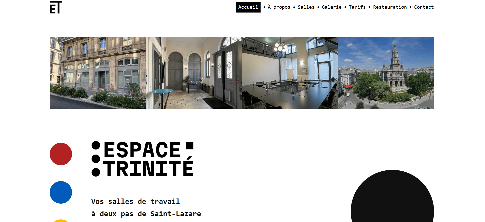

# 🌿 Espace Trinité — Site vitrine

Bienvenue sur le dépôt du site vitrine d’Espace Trinité, conçu pour offrir une expérience fluide, élégante et informative à tous les visiteurs souhaitant découvrir les différentes salles disponibles à la location.

---

## 🌐 Objectif

Créer une interface web moderne, responsive et intuitive, présentant chaque salle sous forme de galeries, avec un design épuré et une navigation simple.  
L'ensemble est optimisé pour un hébergement statique sécurisé avec **formulaire de contact protégé par CAPTCHA**.

---

## 🧱 Technologies utilisées

- **HTML5**
- **CSS3**
- **JavaScript (modulaire)**
- **Fonctions serverless Netlify**
- **Cloudflare Turnstile (CAPTCHA anti-spam sécurisé)**
- **Brevo (ex-Sendinblue) – Envoi d’email via API**

---

## 🧾 Informations techniques

### 🔐 Domaine et DNS

- **Nom de domaine :** [`espacetrinite.fr`](https://espacetrinite.fr)
- **Registrar :** [OVHcloud](https://www.ovh.com/)
- **Gestion DNS :** [Cloudflare](https://www.cloudflare.com/)

#### 🔧 Configuration DNS (Cloudflare)

| Type   | Nom               | Contenu                          | Proxy Cloudflare | TTL         |
|--------|-------------------|----------------------------------|------------------|-------------|
| A      | espacetrinite.fr  | `75.2.60.5` *(Netlify)*          | ❌ DNS uniquement | Automatique |
| CNAME  | www               | `espacetrinite.netlify.app`      | ❌ DNS uniquement | Automatique |

> 💡 **Entrées DNS en mode "DNS uniquement"** (proxy Cloudflare désactivé) pour permettre à Netlify de gérer directement le HTTPS, en complément du chiffrement SSL/TLS automatique de Cloudflare.

### 📄 Redirection HTTPS forcée

La redirection HTTP ➝ HTTPS est gérée via le fichier `netlify.toml` :

```toml
[[redirects]]
from = "http://*"
to = "https://:host/:splat"
status = 301
force = true

### 📄 Redirection HTTPS forcée

La redirection HTTP ➝ HTTPS est gérée via le fichier `netlify.toml` :

```toml
[[redirects]]
from = "http://*"
to = "https://:host/:splat"
status = 301
force = true
```

---

## ✉️ Formulaire de contact sécurisé

Le formulaire est protégé contre les spams via [Cloudflare Turnstile](https://developers.cloudflare.com/turnstile/), et les messages sont transmis via l’API de [Brevo](https://www.brevo.com/fr/).

### 🔒 Variables d’environnement Netlify requises

| Clé                | Description                                      |
|--------------------|--------------------------------------------------|
| `TURNSTILE_SECRET` | Clé secrète Cloudflare Turnstile                 |
| `FORM_SECRET_KEY`  | Clé partagée utilisée côté client + fonction     |
| `BREVO_API_KEY`    | Clé API Brevo pour l’envoi d’emails sécurisés    |
| `DEST_EMAIL`       | Adresse de destination pour les messages         |

Deux fonctions serverless assurent la sécurité :

- `/functions/validate-captcha.js` → Vérifie le CAPTCHA côté serveur  
- `/functions/send-mail.js` → Envoie l’email en POST sécurisé à Brevo

---

## 📁 Arborescence du projet

```
espace-trinite/
├── assets/
│   ├── favicon/         # Favicon du site
│   ├── icons/           # Icônes utilisées
│   ├── img/             # Images des galeries
│   └── logo/            # Logos
│
├── css/
│   ├── style.css        # Style global du site
│   └── header.css       # Style spécifique à l'en-tête
│
├── js/
│   ├── mail.js              # Gestion du formulaire et validation CAPTCHA
│   ├── header.js            # Animation du menu sticky
│   ├── galerie.js           # Gestion des galeries par salle
│   ├── assistant.js         # Mini assistant de recherche de salle
│   ├── cookie-consent.js    # Gestion du bandeau cookies (RGPD)
│   └── map-consent.js       # Affichage conditionnel de la carte Maps
│
├── netlify/
│   └── functions/
│       ├── send-mail.js         # Envoi sécurisé via SMTP API (Brevo)
│       └── validate-captcha.js  # Validation Cloudflare Turnstile côté serveur
│
├── index.html                # Page principale
├── mentions-legales.html     # Page RGPD / légale
├── confidentialite.html      # Politique de confidentialité
├── 404.html                  # Page d’erreur personnalisée
├── netlify.toml              # Configuration Netlify
├── package.json              # Dépendances backend (axios)
└── README.md                 # Présentation du projet
```

---

## 🛡️ Sécurité & RGPD

✅ **Formulaire sécurisé** :  
→ Utilisation du CAPTCHA **Cloudflare Turnstile**  
→ Validation serveur via `/netlify/functions/validate-captcha.js`  
→ Envoi sécurisé via `/netlify/functions/send-mail.js` et **Brevo SMTP API**  
→ Vérification d’une clé secrète `FORM_SECRET_KEY` côté client/serveur

✅ **Cookies RGPD** :  
→ Consentement explicite requis pour l'affichage de la carte Google Maps  
→ Bandeau de cookies géré via `cookie-consent.js`

---

## ▶️ Utilisation locale

Tu peux tester le site localement simplement en ouvrant `index.html` dans ton navigateur.

---

## 🚀 Déploiement

Le site est optimisé pour un hébergement statique avec exécution de fonctions serverless.  
Plateformes compatibles :

- **Netlify** ✅ *(recommandé)*
- Vercel
- OVHcloud (avec redirection vers Netlify)
- GitHub Pages *(sans les fonctions)*

---

## 🛟 Mentions légales

- `mentions-legales.html` → Obligations légales
- `confidentialite.html` → Politique de confidentialité (RGPD)

---

## 📬 Contact

Pour toute demande ou suggestion :  
📧 adrien.morel@gmail.com

---

## 📸 Aperçu


