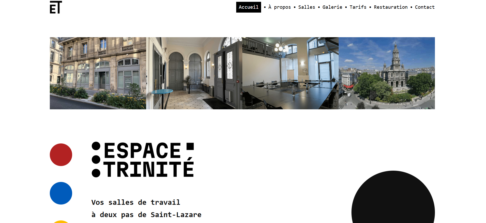

# 🌿 Espace Trinité — Site vitrine

Bienvenue sur le dépôt du site vitrine d’Espace Trinité, conçu pour offrir une expérience fluide, élégante et informative à tous les visiteurs souhaitant découvrir les différentes salles disponibles à la location.

---

## 🌐 Objectif

Créer une interface web moderne, responsive et intuitive, présentant chaque salle sous forme de galeries, avec un design épuré et une navigation simple.  
L'ensemble est optimisé pour un hébergement statique sécurisé avec **formulaire de contact protégé par CAPTCHA**.

---

## 🧱 Technologies utilisées

- **HTML5**
- **CSS3**
- **JavaScript (modulaire)**
- **Fonctions serverless Netlify**
- **Cloudflare Turnstile (CAPTCHA anti-spam sécurisé)**
- **Brevo (ex-Sendinblue) – Envoi d’email via API**
- **SheetJS (XLSX) – Chargement dynamique des tarifs depuis un fichier Excel**
  
---

## 💰 Gestion dynamique des tarifs

Les tarifs des salles ne sont plus codés en dur dans le HTML ou JavaScript.  
Ils sont désormais chargés dynamiquement depuis un fichier Excel (`tarifs_salles.xlsx`) via la bibliothèque **SheetJS**.

Ce fichier contient les prix à jour pour chaque salle, au format :

| Nom de la salle            | Journée (€) | Demi-journée (€) | Tarif horaire (€) |
|----------------------------|-------------|------------------|-------------------|
| Salle Pierre Goursat       | 640         | 460              | 150               |
| Salle d'Estienne d'Orves      | 580         | 405              | 140               |
| Salle Messiaen             | 740         | 540              | 190               |
| Salle La Bruyère           | 800         | 580              | 200               |

Ces données alimentent la section **Tarifs** de la page d’accueil (grille responsive).

> ✅ Plus besoin de modifier le code pour ajuster les prix : une mise à jour du fichier `.xlsx` suffit.

---

## 🧭 Structure du site

La navigation de la page d’accueil (`index.html`) est organisée en 7 sections principales, accessibles via le menu :

1. `#accueil` — Introduction, slogan, visuel et lien rapide vers les salles
2. `#apropos` — Présentation du lieu et de son histoire
3. `#salles` — Aperçu des différentes salles disponibles
4. `#galerie` — Galerie photo interactive par salle
5. `#tarifs` — Informations tarifaires
6. `#restauration` — Options de restauration (traiteurs, partenaires)
7. `#contact` — Formulaire de contact sécurisé

Trois pages autonomes complètent le site :

- `mentions-legales.html` — Mentions légales et informations d’édition
- `confidentialite.html` — Politique de confidentialité (conforme RGPD)
- `conditions.html` — Conditions générales de vente (location de salles)

---

## 🧾 Informations techniques

### 🔐 Domaine et DNS

- **Nom de domaine :** [`espacetrinite.fr`](https://espacetrinite.fr)
- **Registrar :** [OVHcloud](https://www.ovh.com/)
- **Gestion DNS :** [Cloudflare](https://www.cloudflare.com/)

#### 🔧 Configuration DNS (Cloudflare)

| Type   | Nom               | Contenu                          | Proxy Cloudflare | TTL         |
|--------|-------------------|----------------------------------|------------------|-------------|
| A      | espacetrinite.fr  | `75.2.60.5` *(Netlify)*          | ❌ DNS uniquement | Automatique |
| CNAME  | www               | `espacetrinite.netlify.app`      | ❌ DNS uniquement | Automatique |

> 💡 **Entrées DNS en mode "DNS uniquement"** (proxy Cloudflare désactivé) pour permettre à Netlify de gérer directement le HTTPS, en complément du chiffrement SSL/TLS automatique de Cloudflare.

### 📄 Redirection HTTPS forcée

La redirection HTTP ➝ HTTPS est gérée via le fichier `netlify.toml` :

```toml
[[redirects]]
from = "http://*"
to = "https://:host/:splat"
status = 301
force = true
```

---

## ✉️ Formulaire de contact

Champs : nom, email, téléphone, salle souhaitée, date, nombre de participants, message (auto-extensible).
Protégé par [Cloudflare Turnstile](https://developers.cloudflare.com/turnstile/), envoi via [Brevo](https://www.brevo.com/fr/). Feedback inline (pas d’`alert()`).

### 🔒 Variables d’environnement Netlify requises

| Clé                | Description                                      |
|--------------------|--------------------------------------------------|
| `TURNSTILE_SECRET` | Clé secrète Cloudflare Turnstile                 |
| `FORM_SECRET_KEY`  | Clé partagée utilisée côté client + fonction     |
| `BREVO_API_KEY`    | Clé API Brevo pour l’envoi d’emails sécurisés    |
| `DEST_EMAIL`       | Adresse de destination pour les messages         |

Deux fonctions serverless assurent la sécurité :

- `/functions/validate-captcha.js` → Vérifie le CAPTCHA côté serveur  
- `/functions/send-mail.js` → Envoie l’email en POST sécurisé à Brevo

---

## 📁 Arborescence du projet

```
espacetrinite/
├── assets/
│   ├── favicon/                  # Favicon du site
│   ├── icons/                    # Icônes utilisées
│   ├── img/                      # Images des galeries
│   └── logo/                     # Logos
│
├── css/
│   ├── style.css                 # Style global du site
│   └── header.css                # Style spécifique à l'en-tête
│
├── js/
│   ├── mail.js                   # Formulaire de contact : validation CAPTCHA, envoi, feedback inline
│   ├── header.js                 # Animation du menu sticky
│   ├── galerie.js                # Galerie photo par salle (masonry + zoom)
│   ├── consent.js                # Bandeau cookies + consentement carte Maps
│   └── tarifs_dynamic_loader.js  # Chargement dynamique des tarifs depuis Excel
│
├── netlify/
│   └── functions/
│       ├── send-mail.js          # Envoi sécurisé via SMTP API (Brevo)
│       └── validate-captcha.js   # Validation Cloudflare Turnstile côté serveur
│
├── index.html                    # Page principale
├── mentions-legales.html         # Mentions légales (page RGPD)
├── confidentialite.html          # Politique de confidentialité
├── conditions.html               # Conditions générales de vente
├── 404.html                      # Page d’erreur personnalisée
├── tarifs_salles.xlsx            # Fichier source des tarifs des salles (Excel)
├── sitemap.xml                   # Plan du site pour les moteurs de recherche
├── robots.txt                    # Instructions SEO pour les robots d'indexation
├── netlify.toml                  # Configuration Netlify (redirects, build, etc.)
├── package.json                  # Dépendances backend (axios)
└── README.md                     # Présentation du projet
```

---

## 🛡️ Sécurité & RGPD

✅ **Formulaire sécurisé** :  
→ Utilisation du CAPTCHA **Cloudflare Turnstile**  
→ Validation serveur via `/netlify/functions/validate-captcha.js`  
→ Envoi sécurisé via `/netlify/functions/send-mail.js` et **Brevo SMTP API**  
→ Vérification d’une clé secrète `FORM_SECRET_KEY` côté client/serveur

✅ **Cookies RGPD** :  
→ Consentement explicite requis pour l'affichage de la carte Google Maps  
→ Bandeau de cookies géré via `cookie-consent.js`

---

## ▶️ Utilisation locale

Tu peux tester le site localement simplement en ouvrant `index.html` dans ton navigateur.

---

## 🚀 Déploiement

Le site est optimisé pour un hébergement statique avec exécution de fonctions serverless.  
Plateformes compatibles :

- **Netlify** ✅ *(recommandé)*
- Vercel
- OVHcloud (avec redirection vers Netlify)
- GitHub Pages *(sans les fonctions)*

---

## 🛟 Mentions légales

- `mentions-legales.html` → Obligations légales
- `confidentialite.html` → Politique de confidentialité (RGPD)
- `conditions.html` → Conditions générales de vente (location de salles)

---

## 📬 Contact

Pour toute demande ou suggestion :  
📧 adrien.morel@gmail.com

---

## 📸 Aperçu


